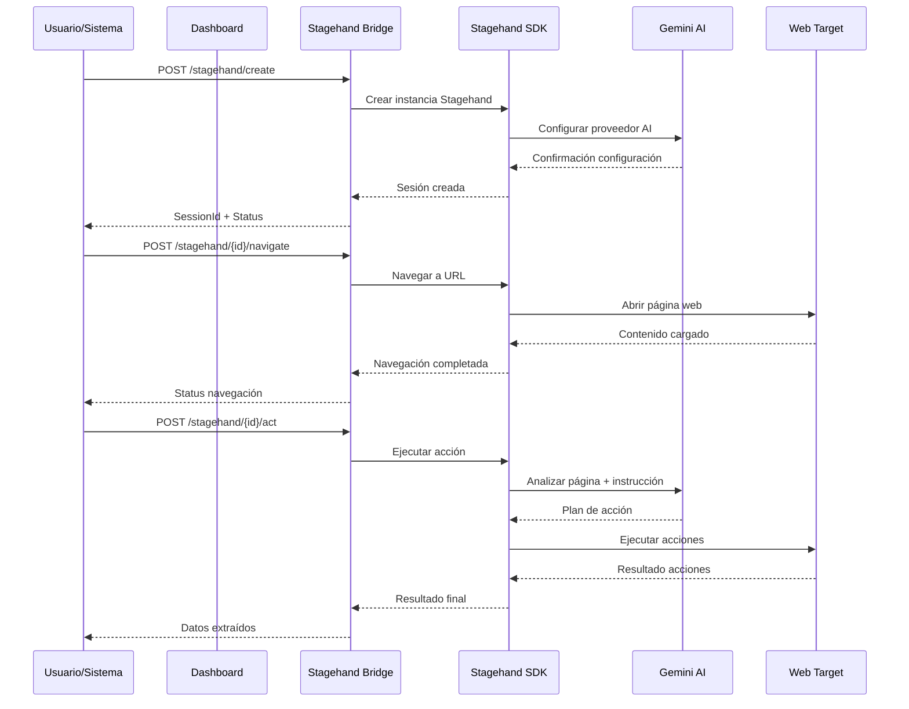

# Arquitectura de Integración - Stagehand + Gemini
## ExtractorOV Modular - Documentación Técnica

---

## 🏗️ Visión General de la Arquitectura

### Diagrama de Componentes

```
┌─────────────────────────────────────────────────────────────┐
│                    ExtractorOV Modular                     │
├─────────────────────────────────────────────────────────────┤
│  ┌─────────────────┐    ┌─────────────────┐                │
│  │   Dashboard     │    │   Extractores   │                │
│  │   Web UI        │    │   Existentes    │                │
│  │  (HTML/JS)      │    │  (Afinia/Aire) │                │
│  └─────────────────┘    └─────────────────┘                │
│           │                       │                        │
│           │              ┌────────▼────────┐               │
│           │              │                 │               │
│           └──────────────►│ Stagehand      │               │
│                          │ Bridge         │               │
│                          │ (Node.js)      │               │
│                          │ Port: 3001     │               │
│                          └────────┬────────┘               │
│                                   │                        │
├───────────────────────────────────┼────────────────────────┤
│                                   │                        │
│  ┌─────────────────┐             │    ┌─────────────────┐  │
│  │   Stagehand     │◄────────────┘    │   Gemini AI     │  │
│  │   SDK           │                  │   Provider      │  │
│  │ (@browserbase)  │◄─────────────────┤   (Google)      │  │
│  └─────────────────┘                  └─────────────────┘  │
│           │                                   │            │
│           ▼                                   │            │
│  ┌─────────────────┐                         │            │
│  │   Playwright    │                         │            │
│  │   Browser       │                         │            │
│  │   Automation    │                         │            │
│  └─────────────────┘                         │            │
│                                               │            │
└───────────────────────────────────────────────┼────────────┘
                                                │
                                    ┌───────────▼────────────┐
                                    │     Internet/Web       │
                                    │   Target Websites      │
                                    └────────────────────────┘
```

---

## 🔧 Componentes Técnicos

### 1. Stagehand Bridge (Capa de Orquestación)

**Archivo:** `stagehand_bridge.js`  
**Tecnología:** Node.js + Express  
**Puerto:** 3001  
**Responsabilidades:**

- **API Gateway:** Expone endpoints REST para interactuar con Stagehand
- **Session Management:** Gestiona múltiples sesiones de automatización
- **AI Integration:** Configura y conecta con Gemini AI
- **Error Handling:** Manejo centralizado de errores y logging
- **CORS Management:** Permite acceso desde diferentes orígenes

#### Endpoints Implementados

```javascript
// Health Check
GET /health
Response: { status: "ok", timestamp: "ISO-8601" }

// Crear Sesión
POST /stagehand/create
Body: { sessionId: string, config: StagehandConfig }

// Navegación
POST /stagehand/:sessionId/navigate
Body: { url: string }

// Futuras extensiones
POST /stagehand/:sessionId/act
POST /stagehand/:sessionId/extract
DELETE /stagehand/:sessionId
```

### 2. Stagehand SDK (Capa de Automatización)

**Paquete:** `@browserbasehq/stagehand`  
**Versión:** Latest  
**Funcionalidades:**

- **Browser Control:** Control programático de navegadores web
- **AI-Powered Actions:** Acciones inteligentes basadas en IA
- **Element Detection:** Detección automática de elementos web
- **Content Extraction:** Extracción inteligente de contenido
- **Multi-Browser Support:** Soporte para Chrome, Firefox, Safari

#### Configuración Técnica

```javascript
const stagehandConfig = {
  modelName: 'gemini-pro',           // Modelo de IA
  apiKey: process.env.GEMINI_API_KEY, // Credencial segura
  verbose: 1,                        // Nivel de logging
  headless: true,                    // Modo sin interfaz
  browserOptions: {
    args: [
      '--no-sandbox',
      '--disable-dev-shm-usage',
      '--disable-gpu'
    ]
  }
};
```

### 3. Gemini AI Provider (Capa de Inteligencia)

**Proveedor:** Google AI  
**Modelo:** gemini-pro  
**Integración:** Via Stagehand SDK  

**Capacidades:**
- **Natural Language Processing:** Interpretación de instrucciones en lenguaje natural
- **Visual Understanding:** Análisis de elementos visuales en páginas web
- **Context Awareness:** Comprensión del contexto de la página
- **Decision Making:** Toma de decisiones inteligentes para automatización

### 4. Dashboard Web (Capa de Presentación)

**Archivo:** `service_dashboard.html`  
**Tecnología:** HTML5 + CSS3 + JavaScript  
**Características:**

- **Real-time Monitoring:** Monitoreo en tiempo real de servicios
- **Service Controls:** Controles para iniciar/detener servicios
- **Activity Logs:** Visualización de logs de actividad
- **Responsive Design:** Diseño adaptativo para diferentes dispositivos

---

## 🔄 Flujo de Datos

### Flujo de Automatización Típico



### Flujo de Datos Interno

1. **Request Processing:**
   ```
   HTTP Request → Express Router → Validation → Stagehand API
   ```

2. **AI Processing:**
   ```
   User Intent → Gemini Analysis → Action Plan → Browser Execution
   ```

3. **Response Flow:**
   ```
   Browser Result → Stagehand Processing → JSON Response → Client
   ```

---

## 🗄️ Gestión de Estado

### Session Management

```javascript
// Estructura de sesión
const sessionState = {
  sessionId: 'unique-identifier',
  stagehandInstance: StagehandObject,
  config: {
    modelName: 'gemini-pro',
    apiKey: 'encrypted-key',
    options: {}
  },
  status: 'active|idle|error',
  lastActivity: timestamp,
  metadata: {
    createdAt: timestamp,
    totalActions: number,
    currentUrl: string
  }
};
```

### Memory Management

- **Session Cleanup:** Limpieza automática de sesiones inactivas
- **Resource Limits:** Límites de memoria y CPU por sesión
- **Garbage Collection:** Recolección de basura optimizada
- **Connection Pooling:** Pool de conexiones para mejor rendimiento

---

## 🔐 Seguridad y Autenticación

### Niveles de Seguridad Implementados

#### 1. API Security
```javascript
// CORS Configuration
app.use(cors({
  origin: ['http://localhost', 'file://'],
  methods: ['GET', 'POST', 'DELETE'],
  allowedHeaders: ['Content-Type', 'Authorization']
}));

// Input Validation
const validateSessionId = (req, res, next) => {
  const { sessionId } = req.params;
  if (!sessionId || !/^[a-zA-Z0-9-_]+$/.test(sessionId)) {
    return res.status(400).json({ error: 'Invalid session ID' });
  }
  next();
};
```

#### 2. Credential Management
```javascript
// Environment Variables
const config = {
  geminiApiKey: process.env.GEMINI_API_KEY,
  port: process.env.STAGEHAND_PORT || 3001,
  logLevel: process.env.LOG_LEVEL || 'info'
};

// Credential Encryption (recomendado)
const encryptedCredentials = encrypt(apiKey, secretKey);
```

#### 3. Browser Security
```javascript
const securityArgs = [
  '--no-sandbox',
  '--disable-dev-shm-usage',
  '--disable-extensions',
  '--disable-plugins',
  '--disable-images', // Para mejor rendimiento
  '--disable-javascript', // Solo si no es necesario
];
```

---

## 📊 Monitoreo y Observabilidad

### Logging Strategy

```javascript
// Winston Logger Configuration
const logger = winston.createLogger({
  level: 'info',
  format: winston.format.combine(
    winston.format.timestamp(),
    winston.format.errors({ stack: true }),
    winston.format.json()
  ),
  transports: [
    new winston.transports.File({ filename: 'stagehand_bridge.log' }),
    new winston.transports.Console({
      format: winston.format.simple()
    })
  ]
});
```

### Métricas Clave

- **Response Time:** Tiempo de respuesta de endpoints
- **Session Count:** Número de sesiones activas
- **Error Rate:** Tasa de errores por endpoint
- **Memory Usage:** Uso de memoria por sesión
- **AI API Calls:** Llamadas a Gemini AI por minuto

### Health Checks

```javascript
// Health Check Implementation
app.get('/health', (req, res) => {
  const healthStatus = {
    status: 'ok',
    timestamp: new Date().toISOString(),
    uptime: process.uptime(),
    memory: process.memoryUsage(),
    activeSessions: Object.keys(sessions).length
  };
  
  res.json(healthStatus);
});
```

---

## 🚀 Escalabilidad y Rendimiento

### Optimizaciones Implementadas

#### 1. Connection Pooling
```javascript
// Browser Instance Pool
const browserPool = {
  maxInstances: 5,
  instances: [],
  getAvailable: () => { /* implementation */ },
  release: (instance) => { /* implementation */ }
};
```

#### 2. Caching Strategy
```javascript
// Session Cache
const sessionCache = new Map();
const CACHE_TTL = 30 * 60 * 1000; // 30 minutos

// Page Content Cache
const contentCache = new LRU({
  max: 100,
  ttl: 10 * 60 * 1000 // 10 minutos
});
```

#### 3. Resource Management
```javascript
// Memory Limits
const resourceLimits = {
  maxMemoryPerSession: '256MB',
  maxConcurrentSessions: 10,
  sessionTimeout: 30 * 60 * 1000, // 30 minutos
  maxActionsPerSession: 1000
};
```

### Estrategias de Escalabilidad

#### Horizontal Scaling
- **Load Balancer:** Nginx o HAProxy
- **Multiple Instances:** PM2 cluster mode
- **Database:** Redis para estado compartido
- **Message Queue:** Para tareas asíncronas

#### Vertical Scaling
- **CPU Optimization:** Worker threads para tareas intensivas
- **Memory Optimization:** Garbage collection tuning
- **I/O Optimization:** Async/await patterns

---

## 🔧 Configuración y Deployment

### Environment Configuration

```bash
# .env file
NODE_ENV=production
STAGEHAND_PORT=3001
GEMINI_API_KEY=your_api_key_here
LOG_LEVEL=info
MAX_SESSIONS=10
SESSION_TIMEOUT=1800000
BROWSER_HEADLESS=true
```

### Docker Configuration (Futuro)

```dockerfile
FROM node:18-alpine

WORKDIR /app
COPY package*.json ./
RUN npm ci --only=production

COPY . .

EXPOSE 3001
CMD ["node", "stagehand_bridge.js"]
```

### PM2 Configuration

```json
{
  "name": "stagehand-bridge",
  "script": "stagehand_bridge.js",
  "instances": "max",
  "exec_mode": "cluster",
  "env": {
    "NODE_ENV": "production",
    "PORT": 3001
  }
}
```

---

## 🧪 Testing Strategy

### Unit Tests (Recomendado)

```javascript
// Jest configuration
describe('Stagehand Bridge API', () => {
  test('Health endpoint returns 200', async () => {
    const response = await request(app).get('/health');
    expect(response.status).toBe(200);
    expect(response.body.status).toBe('ok');
  });

  test('Create session with valid config', async () => {
    const config = {
      sessionId: 'test-session',
      config: { modelName: 'gemini-pro' }
    };
    
    const response = await request(app)
      .post('/stagehand/create')
      .send(config);
      
    expect(response.status).toBe(201);
  });
});
```

### Integration Tests

```javascript
// Playwright integration tests
describe('Stagehand Integration', () => {
  test('Navigate and extract data', async () => {
    // Create session
    const sessionResponse = await createSession();
    const sessionId = sessionResponse.sessionId;
    
    // Navigate
    await navigateToUrl(sessionId, 'https://example.com');
    
    // Extract data
    const data = await extractData(sessionId, 'title');
    expect(data).toBeDefined();
  });
});
```

---

## 📋 Roadmap Técnico

### Fase 1: Estabilización (Completada)
- ✅ Implementación básica de Stagehand Bridge
- ✅ Integración con Gemini AI
- ✅ Dashboard de monitoreo
- ✅ Documentación técnica

### Fase 2: Optimización (Próxima)
- 🔄 Implementar caching avanzado
- 🔄 Añadir métricas detalladas
- 🔄 Optimizar gestión de memoria
- 🔄 Implementar rate limiting

### Fase 3: Escalabilidad (Futura)
- 📋 Soporte para múltiples instancias
- 📋 Base de datos para persistencia
- 📋 Queue system para tareas
- 📋 Auto-scaling capabilities

### Fase 4: Extensibilidad (Futura)
- 📋 Plugin system
- 📋 Custom AI providers
- 📋 Advanced workflow engine
- 📋 GraphQL API

---

## 🔍 Troubleshooting Técnico

### Diagnóstico de Problemas

#### 1. Memory Leaks
```javascript
// Memory monitoring
setInterval(() => {
  const usage = process.memoryUsage();
  if (usage.heapUsed > MEMORY_THRESHOLD) {
    logger.warn('High memory usage detected', usage);
    // Trigger cleanup
  }
}, 60000);
```

#### 2. Session Cleanup
```javascript
// Automatic cleanup
setInterval(() => {
  const now = Date.now();
  Object.keys(sessions).forEach(sessionId => {
    const session = sessions[sessionId];
    if (now - session.lastActivity > SESSION_TIMEOUT) {
      cleanupSession(sessionId);
    }
  });
}, 300000); // 5 minutos
```

#### 3. Error Recovery
```javascript
// Graceful error handling
process.on('uncaughtException', (error) => {
  logger.error('Uncaught exception:', error);
  // Cleanup and restart
  gracefulShutdown();
});

process.on('unhandledRejection', (reason, promise) => {
  logger.error('Unhandled rejection at:', promise, 'reason:', reason);
});
```

---

*Documentación técnica generada por Sentinel Códice*  
*Última actualización: 13 de octubre de 2025*